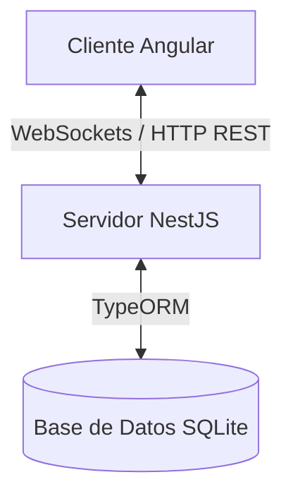
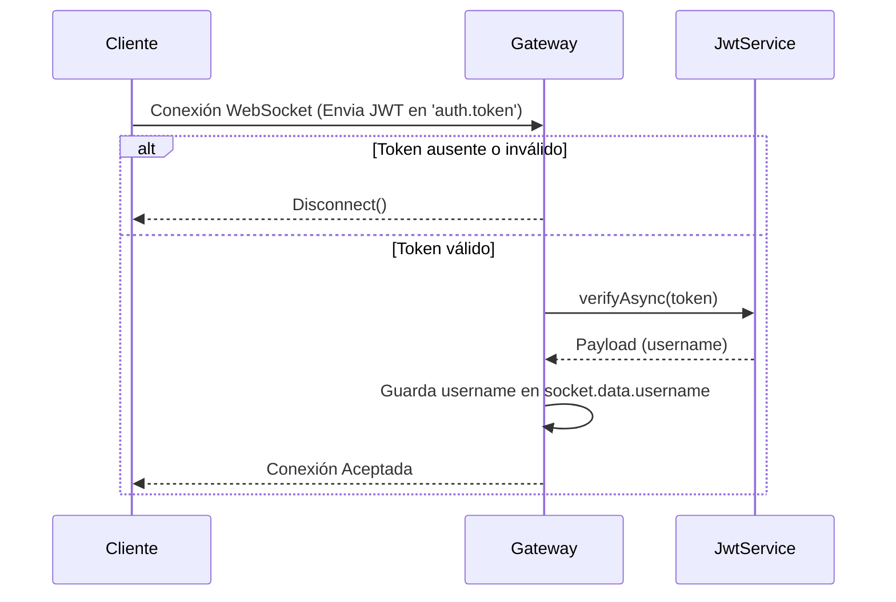

# 🛠️ Manual Técnico — Sistema de Chat en Tiempo Real

Este manual técnico describe la arquitectura, la configuración de la base de datos, el diseño de la red mediante sockets, y la seguridad del sistema de chat desarrollado para el proyecto de **Aplicaciones Distribuidas**.

---

## 1. Arquitectura General del Sistema

El sistema utiliza una arquitectura **Cliente-Servidor de Capa Desacoplada**:



- **Cliente (Frontend)**: Desarrollado en Angular 17. Es una aplicación web SPA (Single Page Application) que gestiona la interfaz del chat y mantiene una conexión activa por WebSocket con el servidor.
- **Servidor (Backend)**: Desarrollado en NestJS. Expone una API REST para registro/login y un servidor de WebSockets (Socket.io) para la comunicación bidireccional en tiempo real.
- **Base de Datos**: Base de datos relacional SQLite persistida localmente en un archivo para garantizar portabilidad.

---

## 2. Tecnologías Utilizadas

- **NestJS (v10)**: Framework progresivo de Node.js estructurado y basado en TypeScript.
- **Angular (v17)**: Framework frontend para interfaces dinámicas y reactivas.
- **Socket.io**: Biblioteca para habilitar comunicación bidireccional en tiempo real basada en eventos.
- **TypeORM**: Object-Relational Mapper (ORM) que permite interactuar con la base de datos mediante clases y métodos de TypeScript.
- **SQLite**: Motor de base de datos SQL auto-contenido que almacena los datos en un archivo binario local (`database.sqlite`).
- **JSON Web Tokens (JWT)**: Método seguro para autenticar peticiones HTTP y autorizar la conexión del socket de forma criptográfica.
- **Bcrypt**: Algoritmo de hash seguro para el almacenamiento seguro de contraseñas de usuario.

---

## 3. Estructura del Proyecto

El repositorio está organizado en dos subproyectos principales:

### Backend (`/backend`)
- `src/main.ts`: Punto de entrada que inicializa NestJS y expone CORS.
- `src/app.module.ts`: Módulo raíz donde se inicializa la conexión con SQLite mediante `TypeOrmModule`.
- `src/auth/`: Módulo de autenticación (Controller, Service, JWT setup).
- `src/users/`: Entidades de base de datos (`user.entity.ts`) y servicios de persistencia de usuarios.
- `src/chat/`: Gateway de WebSockets (`chat.gateway.ts`) que maneja la conexión segura y los eventos de chat.

### Frontend (`/frontend`)
- `src/main.ts`: Configura e inicializa la aplicación Angular.
- `src/app/app.routes.ts`: Definición de rutas y protección mediante `authGuard`.
- `src/app/services/`:
  - `auth.service.ts`: Maneja peticiones HTTP de login/registro y almacena el token JWT.
  - `socket.service.ts`: Abstrae la conexión socket y expone Observables con los eventos recibidos.
- `src/app/pages/`:
  - `login/`: Componente de interfaz de acceso e inicio.
  - `chat/`: Componente principal de la sala de chat en tiempo real.

---

## 4. Instalación y Configuración Local

### Requisitos Previos
- **Node.js** v18 o superior.
- **npm** v9 o superior.

### Configuración del Backend
1. Navegar al directorio del backend:
   ```bash
   cd backend
   ```
2. Instalar las dependencias (incluyendo TypeORM y el driver de SQLite):
   ```bash
   npm install
   ```
3. Crear un archivo `.env` en la raíz de la carpeta `backend` con la siguiente variable (o el sistema usará una por defecto):
   ```env
   JWT_SECRET=tu_secreto_super_seguro
   PORT=3000
   ```
4. Iniciar el servidor de desarrollo:
   ```bash
   npm run start:dev
   ```
   *El servidor creará automáticamente el archivo `database.sqlite` en la raíz de `backend` e iniciará en `http://localhost:3000`.*

### Configuración del Frontend
1. Navegar al directorio del frontend:
   ```bash
   cd ../frontend
   ```
2. Instalar las dependencias:
   ```bash
   npm install
   ```
3. Iniciar el servidor de desarrollo de Angular:
   ```bash
   npm run start
   # o bien: ng serve
   ```
   *La aplicación estará accesible en `http://localhost:4200`.*

---

## 5. Funcionamiento del Servidor y Base de Datos (Persistencia)

### Entidad de Usuario (`user.entity.ts`)
Los datos se modelan y persisten utilizando TypeORM mapeando la clase a la tabla `users` en SQLite:

```typescript
@Entity('users')
export class User {
  @PrimaryGeneratedColumn()
  id: number;

  @Column({ unique: true })
  username: string;

  @Column()
  password: string; // Hash seguro bcrypt
}
```

### Flujo de Registro y Login
1. El usuario se registra: se encripta la contraseña usando `bcrypt.hash(..., 10)` y se guarda el registro en SQLite.
2. El usuario inicia sesión: se valida el hash con `bcrypt.compare()`. Si es correcto, el servidor firma un token JWT que contiene el `username` y `userId` y expira en 24 horas.

---

## 6. Comunicación mediante Sockets y Seguridad JWT

Para cumplir con las pautas de integridad y seguridad de datos, se ha implementado un flujo de autenticación estricto en la conexión de WebSockets:



### Eventos de WebSocket Implementados

| Evento Enviado (Emit) | Payload Esperado | Descripción / Lógica de Seguridad |
|---|---|---|
| `join` | *Ninguno* | Registra al usuario en la lista de activos. El backend lee el username de `socket.data.username` (token verificado), evitando spoofing. Envía el historial de chat al cliente. |
| `sendMessage` | `{ message: string }` | Emite el mensaje a todos los clientes. El backend asocia el mensaje al username verificado en `socket.data.username`. |
| `typing` | `{ isTyping: boolean }` | Notifica a todos los clientes conectados (excepto al emisor) que un usuario está escribiendo. |

| Evento Escuchado (On) | Estructura del Objeto Recibido | Descripción |
|---|---|---|
| `receiveMessage` | `{ username: string, message: string, timestamp: string, type: 'message' \| 'system' }` | Renderiza el mensaje en el chat con formato distintivo para el usuario propio. |
| `messageHistory` | `ChatMessage[]` | Recibe los últimos 50 mensajes transmitidos en la sala al conectarse. |
| `updateUsers` | `string[]` | Recibe la lista actualizada de los nombres de los usuarios conectados en tiempo real. |
| `userTyping` | `{ username: string, isTyping: boolean }` | Activa o desactiva la barra de indicador de escritura en el chat. |
